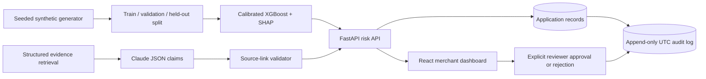

# ChargebackShield

**ChargebackShield** is a defense-only, explainable chargeback-risk demonstrator for the Razorpay AI Buildathon. It combines a calibrated tabular risk model with a source-constrained evidence drafting workflow, then exposes both through a six-screen merchant dashboard. The project uses synthetic data only; its reproducible results are not a claim of production performance on Razorpay, any payment network, or a merchant portfolio.

> **Core safety premise:** a score is a recommendation, an evidence response is a draft, and an approval only records a local human-review state. This project deliberately has no money-movement capability and no external payment-network submission integration.

## What is included

| Capability | Implementation | Accountability property |
|---|---|---|
| Synthetic data pipeline | `ml/train.py` deterministically generates 20,000 Razorpay-shaped records from a seed, controlled anomaly rates, and configurable loss assumptions. | Train, validation, and held-out test splits are persisted separately. |
| Stage A risk scoring | XGBoost, class-imbalance weighting, validation-only sigmoid calibration, and SHAP artifacts. | Returns a calibrated risk score, tier, recommended action, model version, and top feature contributions. |
| Stage B evidence drafting | FastAPI retrieves persisted structured fields, requests strict JSON claims from Claude Sonnet server-side, then validates every source key. | Unsupported facts become explicit insufficient-evidence statements; a deterministic safety fallback preserves that behavior if the model is unavailable. |
| Human review | Generate, approve, and reject operations appear in the Evidence Studio. | Approval requires an existing draft; rejection requires a reason; neither operation contacts a payment platform. |
| Auditability | Auditable scores, drafts, decisions, metrics, and application events are persisted with UTC times, actor, input hash, output summary, and model version. | The API exposes audit-log reads only; update and delete routes are not implemented or exposed. |
| Merchant UX | Overview, Risk Feed, Dispute Queue, Evidence Studio, Transparency, and Audit Log. | The dashboard uses visible explanations and does not represent a recommendation as an automatic action. |
| Controlled merchant-data intake | Import Data lets an authenticated administrator create a bounded UTF-8 CSV preview and explicitly confirm scoring. | Sensitive columns such as card numbers, CVV/CVC, UPI PIN, contact data, and addresses are rejected; original CSV bytes are not stored. |
| Audit intelligence | Advanced period, action, actor, entity, and outcome filters plus interactive audit-activity and chargeback-trend charts. | Exports are derived from the visible, filtered, append-only event view. |
| Evidence PDF | The Evidence Studio can download a server-generated PDF of an existing draft. | The PDF includes source links, evidence gaps, model/review metadata, a no-external-action notice, `no-store`, and an export audit event. |

## Documentation map

| Document | Use it for |
|---|---|
| [`ARCHITECTURE.md`](ARCHITECTURE.md) | System components, deployment topology, model/evidence workflow, and control boundaries. |
| [`METRICS.md`](METRICS.md) | Synthetic held-out evaluation, threshold-cost assumptions, and limitations. |
| [`SECURITY.md`](SECURITY.md) | Safety model, data minimization, review gate, and audit controls. |
| [`docs/API_REFERENCE.md`](docs/API_REFERENCE.md) | All FastAPI endpoints, request behavior, and failure semantics. |
| [`docs/IMPORT_CONTRACT.md`](docs/IMPORT_CONTRACT.md) | Approved CSV columns, excluded sensitive fields, limits, and sample format. |
| [`docs/WALKTHROUGH.md`](docs/WALKTHROUGH.md) | Recording-ready five-minute demo run sheet. |
| [`CONTRIBUTING.md`](CONTRIBUTING.md) | Local setup, checks, and guardrail-preserving contribution rules. |
| [`docs/CONFIGURATION.md`](docs/CONFIGURATION.md) | Safe local/runtime configuration guidance without committed secrets. |

## Architecture

The source for the diagram is [`docs/architecture.mmd`](docs/architecture.mmd); a rendered build artifact is available in the project at [`chargebackshield-architecture.png`](/manus-storage/chargebackshield-architecture_fa6d344a.png). The implementation deliberately keeps each control boundary separate: data generation and model training produce versioned artifacts; the FastAPI reference service owns model inference and evidence retrieval; the React dashboard presents outputs and invokes only bounded review actions.



Read [`ARCHITECTURE.md`](ARCHITECTURE.md) for data models, API boundaries, source-link validation, and deployment behavior.

## Reproducible ML workflow

The model workflow requires Python 3.11 or later. It writes all output to a caller-selected directory, so it can be rerun without mixing artifacts with source code.

```bash
python3 -m pip install -r ml/requirements.txt
python3 ml/train.py --rows 20000 --seed 42 --output-dir /tmp/chargebackshield-artifacts \
  --geo-mismatch-rate 0.14 --velocity-spike-rate 0.12 \
  --first-time-rate 0.12 --high-amount-anomaly-rate 0.12 \
  --new-device-base-rate 0.10 \
  --false-positive-cost-cents 18000 --false-negative-cost-cents 260000
```

The script saves `train.csv`, `validation.csv`, `held_out_test.csv`, an XGBoost model, probability calibrator, SHAP explainer, feature order, evaluation JSON, a confusion matrix, and a threshold-cost chart. The decision threshold is selected on the validation split; the held-out set is evaluated after that selection rather than used to tune it. Model calibration and explainability follow the documented interfaces of scikit-learn and SHAP. [1] [2]

## Run the FastAPI reference service

The reference service loads the saved model artifacts and initializes a local SQLite demonstrator store. It seeds a small synthetic merchant scenario for the dashboard walkthrough.

```bash
python3 -m pip install -r ml/requirements.txt
uvicorn ml.api:app --host 127.0.0.1 --port 8001
```

| Endpoint | Purpose | Safety behavior |
|---|---|---|
| `POST /score` | Scores a structured transaction and records top model contributions. | Returns a recommendation only. |
| `POST /imports/preview` | Validates a bounded merchant CSV file and returns a time-limited preview. | Requires an authenticated administrator; retains no original CSV body and does not score records. |
| `POST /imports/confirm` | Explicitly scores the exact, administrator-bound validated preview. | One-time only; expires after 15 minutes and is audited with server-derived actor identity. |
| `GET /imports` | Lists import metadata and validation outcomes. | Read-only; exposes no raw CSV content. |
| `GET /transactions` | Lists previously scored transactions and optionally filters by tier. | Read-only. |
| `GET /disputes` | Lists the local dispute queue and evidence status. | Read-only. |
| `POST /evidence/generate/{dispute_id}` | Retrieves structured evidence, drafts source-linked JSON claims, and stores a review draft. | Returns explicit insufficiency statements for missing evidence. |
| `POST /evidence/approve/{dispute_id}` | Records a named reviewer approval. | Requires a generated draft and creates no external submission. |
| `POST /evidence/reject/{dispute_id}` | Records a named reviewer rejection. | Requires a rejection reason. |
| `GET /evidence/export/{dispute_id}.pdf` | Downloads a source-linked evidence draft as a PDF. | Requires a generated draft, sets `Cache-Control: no-store`, and records the export; it does not submit externally. |
| `GET /metrics` | Reads the persisted held-out model evaluation. | Read-only. |
| `GET /audit-log` | Reads the UTC application audit stream. | Read-only; no mutation endpoint is provided. |
| `GET /audit-filters` and `GET /audit-analytics` | Supplies dashboard filter options and period-based activity/chargeback-trend aggregates. | Read-only aggregates over the audit and local dispute records. |

The service uses a server-side Claude call with strict JSON Schema output for the evidence workflow. The response is subsequently checked against a whitelist of source keys held in the retrieved snapshot; the model cannot introduce an unlinked source field. [3]

## Run the dashboard

In a second terminal, start the full-stack web application:

```bash
pnpm install
pnpm dev
```

The dashboard calls the FastAPI service via `/risk-api`. CSV imports are additionally checked at the authenticated application gateway: only an administrator can create and confirm a preview, and the recorded importer identity comes from the server-side session rather than a browser-supplied field. If the service is unavailable, the Evidence Studio remains viewable with the shipped safe demo draft, and attempts to generate a live draft show a clear availability message rather than silently fabricating output.

## Evaluation results

The committed example evaluation uses **20,000 synthetic transactions**, seed `42`, and a 70/15/15 split. The final held-out split contains 3,000 rows with a synthetic dispute rate of 5.42%.

| Metric | Held-out result |
|---|---:|
| Precision | 32.40% |
| Recall | 64.20% |
| F1 | 0.4306 |
| ROC–AUC | 0.9086 |
| Average precision | 0.4630 |
| Validation-selected threshold | 0.120 |
| Confusion matrix | TP 104 · FP 217 · TN 2,621 · FN 58 |

The reported false-positive and false-negative costs are scenario assumptions, not observed merchant losses. At the comparison thresholds, the lowest illustrated held-out expected loss is ₹1,59,360 at threshold 0.03 under the stated assumptions; that does not by itself make the threshold appropriate for a real merchant. Read the full threshold table, limitations, and evidence-grounding reporting note in [`METRICS.md`](METRICS.md).

## Tests

```bash
CHARGEBACKSHIELD_SKIP_LLM=1 python3 -m unittest ml.test_api
pnpm test
pnpm check
```

The Python suite verifies bounded scoring, explicit insufficiency handling, supported-claim source links, approval requirements, local-only approval behavior, rejection-reason requirements, valid rejection audit events, and absence of audit-log update/delete routes. The Vitest suite verifies the TypeScript guardrail policy and existing authentication behavior.

The CSV tests cover administrator-only preview access, owner-bound confirmation, expired/altered/consumed preview rejection, model-scored transaction persistence, original-file non-retention, sensitive-column rejection, structured format-error output, and corresponding import audit events. The evidence-export test verifies an actual PDF response, attachment and no-store headers, and an export audit event.

## Recording the five-minute walkthrough

Use [`docs/WALKTHROUGH.md`](docs/WALKTHROUGH.md) as the recording run sheet. It covers the problem, architecture, scoring explanation, grounded evidence generation, explicit insufficiency failure path, review gate, audit log, transparency screen, and honest limitations.

## References

[1]: https://scikit-learn.org/stable/modules/calibration.html "scikit-learn: Probability calibration"
[2]: https://shap.readthedocs.io/en/latest/ "SHAP documentation"
[3]: https://docs.anthropic.com/en/docs/build-with-claude/overview "Anthropic: Build with Claude"
